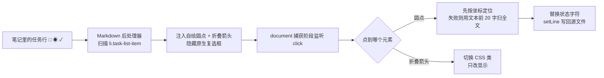

# 语雀待办 · Obsidian Yuque Todo


> Obsidian 里的任务列表，点一下就按 `□ → ◉ → ✓` 三态循环，状态直接写回笔记。
> Click a task to cycle it through `□ todo → ◉ doing → ✓ done`, with the state written straight back into your Markdown.

| 项 | 值 |
|---|---|
| 当前版本 | 1.0.0 |
| 许可 | 未声明（仓库暂无 `LICENSE` 文件） |
| 平台 | Obsidian 桌面端 + 移动端（`isDesktopOnly: false`） |
| 支持范围 | Obsidian ≥ 0.15.0；只接管标准 Markdown 任务列表 |

## 1、为什么要做

- Obsidian 原生复选框只有「未完成 / 完成」两态，**正在做的活儿没地方放** —— 只能在正文里补一句「（在做）」。
- 勾选只是换个勾，**看不出哪几条还没动**：长清单里一片圈圈，扫不出重点。
- 子任务一多，列表摊成一片，**没有折叠就没有主线**。
- 想要 `□ / ◉ / ✓` 那种清爽的三态手感，又不想为它引入一整套任务管理插件。

## 2、它做什么

- **点一下切三态**：`□ 待办` → `◉ 进行中` → `✓ 完成` → 回到待办，循环往复。
- **写回源文件**：改的是笔记里的 `[ ]` / `[/]` / `[x]`，不是只改显示。
- **折叠子任务**：带下一级清单的待办，左侧多一个 `▾`，一点收起整段。
- **完成即弱化**：勾上后文字自动变灰并加删除线。
- **跟随主题**：圆点和箭头用 Obsidian 主题变量着色，深浅色主题都协调。
- **零依赖**：不需要 Tasks、Dataview，不联网，不写额外数据文件。

三种状态长这样：

```text
□ 整理本周素材
◉ 剪第一版
✓ 导出成片
```

## 3、怎么用

1. 在笔记里写标准任务列表：`- [ ] 买牛奶`；子任务直接缩进到下一层。
2. 切到**阅读视图**（`Ctrl/Cmd + E` 切换）。
3. 点待办左侧的圆点，每点一次前进一态，**立即写回源文件那一行**。
4. 有子任务的行，点它左边的 `▾` 折叠或展开。

具体例子 —— 源文件这样写：

```markdown
- [ ] 整理本周素材
	- [ ] 收集原始片段
	- [/] 剪第一版
- [x] 导出成片
```

阅读视图里：第一条是空心圆（待办），缩进的两条分别显示 `□` 和 `◉`，最后一条显示绿色 `✓` 且文字带删除线。点第一条的圆点，它变成 `◉`，源文件那一行同时变成 `- [/] 整理本周素材`。

### 命令与快捷键

| 操作 | 怎么触发 | 说明 |
|---|---|---|
| 切换三态 | 左键点待办前的圆点 | 唯一交互入口，没有快捷键 |
| 折叠 / 展开子任务 | 点待办前的 `▾` / `▸` | 只改当前视图，不写进文件 |
| 命令面板 | —— | 插件未注册任何命令，命令面板里搜不到 |

### 生效场景

- **阅读视图**：完整交互 —— 三态圆点、切换、折叠都在这里。
- **实时预览 / 源码视图**：插件注册的是 Markdown 后处理器（官方 API 说明其作用于阅读模式），三态外观与点击不保证一致，以阅读视图为准。
- **悬浮预览 / 嵌入块 / Canvas 卡片**：没有活动编辑器，点击不会写回。

## 4、安装

### 三条路径

1. **手动安装（推荐）**：下载仓库 zip 解压，或 `git clone`，把 `main.js`、`manifest.json`、`styles.css` 三个文件放进 `<你的库>/.obsidian/plugins/yuque-todo/`。
2. **跟着仓库更新**：直接把仓库 `git clone` 进插件目录，以后 `git pull` 就是更新。仓库没有 Release，也没有 npm 包，所以社区插件市场和 BRAT 暂时用不了。
3. **改代码**：克隆到任意目录改，改完再拷进插件目录（见第 6 节）。

### 装完要不要重启

- 插件目录里**新增了文件夹**，必须重启 Obsidian（或在「第三方插件」页点刷新），否则列表里看不到它。
- 首次启用要先关掉「受限模式」，再打开「语雀待办」的开关。
- 之后改代码只需点「重新加载」或按 `Ctrl/Cmd + R` 重载应用，不用退出程序。

### 卸载

- 「设置 → 第三方插件」关掉「语雀待办」，再删掉 `.obsidian/plugins/yuque-todo/` 整个文件夹。
- 插件不产生额外数据文件，卸载后笔记内容原样保留；唯一变化是**进行中的 `[/]` 退回普通未完成复选框**，重新启用即恢复，不需要再配置。

### 兼容与已知坑

| 项 | 值 |
|---|---|
| 最低 Obsidian | 0.15.0（`manifest.json` 声明，未在旧版本实测） |
| 平台 | 桌面端 + 移动端 |
| 依赖 | 无 |
| 其它任务类插件 | 本插件会隐藏原生复选框，与同样改造任务项的插件可能互相抢渲染，未做兼容测试 |

- **`[/]` 不是 Obsidian 原生状态**：停用插件后看不出「进行中」，但内容不会丢。
- **只认 ` `、`/`、小写 `x`**：大写 `- [X]` 不在匹配范围内，可能显示为已完成却点不动。
- **行定位有兜底**：坐标定位失败时按「列表项文本前 20 字」扫全文，**前缀相同的待办可能被改到靠前那一行** —— 待办开头写清楚差异更稳。
- **折叠状态不持久化**：刷新或重开笔记即恢复展开。
- **无设置项、无命令**：所有行为写死在 `main.js` 里，想改行为得改代码。

## 5、它是怎么做到的



- **状态就是文件本身**：`[ ]` / `[/]` / `[x]` 直接躺在 Markdown 里，插件不建索引、不写缓存 —— 卸载后内容完整，换设备打开也对。
- **显示与数据分离**：原生复选框被隐藏，改用注入的 `<span class="yq-cb">`；圆点的颜色与形状全走 `styles.css` 里的主题变量（`--text-faint` / `--text-accent` / `--color-green`），自动跟随明暗主题。
- **双重行定位**：先 `posAtCoords` 按点击坐标命中源行，失败再用「列表项文本前 20 字」扫全文兜底（代价见第 4 节的已知坑）。
- **只动 3 个字符**：写回时用 `^(\s*[-*+]\s+)\[.\]` 精确替换状态位，缩进、`-` 标记、正文一律原样保留。
- **安全边界**：不联网、不读库外文件、不注册命令与后台任务；全局点击监听虽然挂在 `document` 的捕获阶段，但会先判断 `closest('.yq-cb')`，不是插件画的圆点就立刻放行，避免和 Obsidian 自身交互打架。

## 6、开发

### 依赖与构建

- **无 npm 依赖、无打包步骤**：`main.js` 就是最终产物，直接 `require('obsidian')` 用宿主 API，改完即生效。
- 仓库里没有 `package.json`、没有 `lib/` 产物，也没有构建命令；逻辑只在 `main.js`，样式只在 `styles.css`。

### 调试与验证

- 打开开发者工具（`Ctrl/Cmd + Shift + I`），应看到 `YuqueTodo: onload` 和 `YuqueTodo: registered OK`；加载出错会打印 `YuqueTodo: error in onload`。
- 最小验证闭环：改 `main.js` → 重新加载插件 → 阅读视图点圆点 → 看源文件那行是否按 `[ ] → [/] → [x] → [ ]` 变化。
- 改版本号时同步 `manifest.json` 的 `version` 与 README 表格里的「当前版本」。

### 目录树

```text
obsidian-plugin-yuque-todo/
├── main.js        # 插件逻辑：三态循环 + 折叠 + 写回源文件
├── styles.css     # 三态圆点、折叠箭头、缩进线样式
├── manifest.json  # 插件元信息：id / 版本 / 最低 Obsidian 版本
└── README.md
```

### 测试

- 仓库目前没有测试框架，也没有 CI。
- 欢迎补测试，最小目标是覆盖两条路径：状态循环、以及坐标定位失败后的文本兜底。

## 更新日志

- **1.0.0**（2026-06-26）— 首个版本：`□ → ◉ → ✓` 三态点击循环、子任务折叠、状态写回源文件。
- **初始提交**（2026-06-26）— 插件骨架：注入自绘圆点、隐藏原生复选框、捕获点击。
- **文档扩充**（2026-06-27）— 补齐功能清单与用法说明。

完整历史逐条见 [CHANGELOG.md](CHANGELOG.md)。

**License**：仓库暂未提供 `LICENSE` 文件，默认保留所有权利；如需转载、再分发或商用，请先联系作者。
